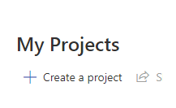

# Introduction

This repository create a custom model with Document Intelligence and test it using a Python Notebook. Document Intelligence allows you to extract information from documents, making it easier to automate data entry and analysis tasks.

## Prerequisites

- Python 3.10 or higher
- Azure CLI installed

## Steps to Run the Bash Script

1. **Login to Azure:**
   Open your terminal and login to your Azure account using the following command:
   ```bash
   az login
   ```
2. **Run the Bash Script:**
   Run the bash script to create the resources in Azure:
   ```bash
   cd scripts
   chmod +x create_resources.sh
   ./create_resources.sh
   ```

## Create the .env file

In the folder notebook you need to create a **.env** file with the following content:

```bash
FULL_RESOURCE_GROUP=rg-doc-demo
STORAGE_NAME_CNX_STRING=
FORM_RECOGNIZER_KEY=
FORM_RECOGNIZER_ENDPOINT=
```

You can retrieve the storage connection string doing the following command:

```bash
az storage account show-connection-string --name "<storage-account-name>" --resource-group "<resource-group-name>" --query connectionString --output tsv
```

You can retrieve the Form Recognizer endpoint running this command

```bash
az cognitiveservices account show --name "resource-name" --resource-group "resource-group-name" --query "properties.endpoint"
```

This will return something like this

```bash
Regional endpoint: https://<region>.api.cognitive.microsoft.com/
Custom subdomain: https://<resource-name>.cognitiveservices.azure.com/
```

The endpoint you need to copy is the Regional endpoint.

Now to retrieve the key you can run this command

```bash
az cognitiveservices account keys list --name "<resource-name>" --resource-group "<resource-group-name>"
```

### Run the notebook step 1 to 3

Now you can run the notebook called **document.ipynb** but only step 1 to 3. Once is done go to the [Document Intelligence Studio](https://documentintelligence.ai.azure.com/studio/)

### Create Custom Model

Once in **Document Intelligence Studio** you need to create a custom model. To do this you need to follow the following steps:

#### Click on the **Custom extraction model**


#### Click on the **Create a project** button



#### Fill the form with the following information:


#### Select your instance of Document Intelligence


#### Select your instance of storage account


#### Click on the **Create project** button


#### Click on the **Train** button, be sure to enter **ModelV1** for the name and click train


